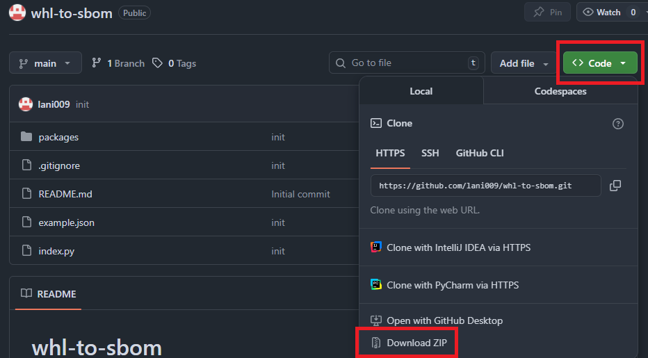
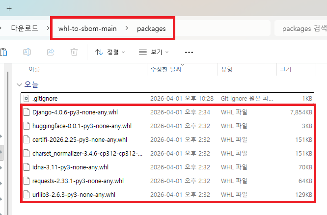
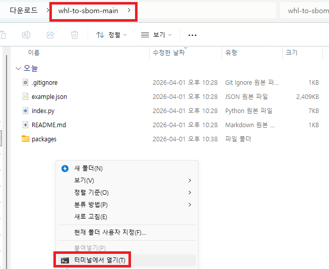
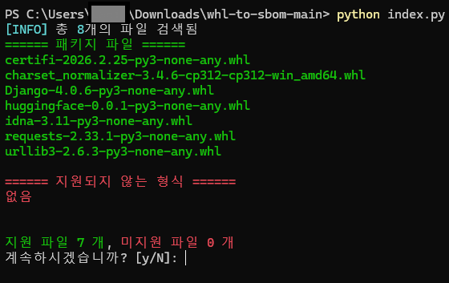
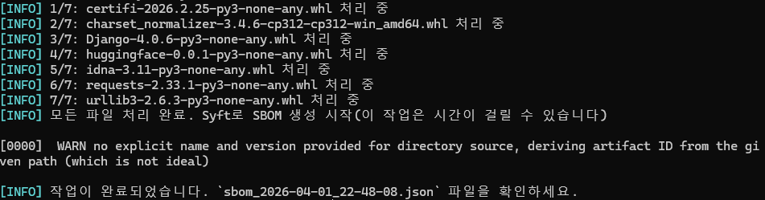

## .whl to SBOM
.whl, .tar.gz 등 파이썬 패키지 파일으로 SBOM을 생성합니다.

### 대상 패키지 형식
- whl, tar.gz, tar.bz2, zip, tar.xz

### 실행 전 조건
- python이 설치되어 있어야 합니다.
- 네트워크(인터넷)이 가능한 환경이어야 합니다.
- `pip download` 등을 통해서 패키지 파일을 미리 다운로드 해놓아야 합니다.

## 사용 방법

### 1. SBOM 생성 프로그램 다운로드
#### 1.1. `Code`를 클릭하여 `Download ZIP`을 실행합니다.


#### 1.2. 다운로드한 파일을 원하는 폴더에 압축 해제합니다.
> 예시) 다운로드 폴더에 압축 해제

### 2. Python package 넣기
#### 2.1. 압축 해제한 폴더의 `packages` 폴더를 열어봅니다.
> 압축 해제한 폴더 -> packages

#### 2.2. SBOM으로 생성할 패키지를 `packages` 폴더에 넣습니다.


### 3. SBOM 생성하기
#### 3.1. 다시 원래 폴더 `whl-to-sbom-main`로 돌아갑니다.
> 다시 아까 압축해제했던 폴더로 이동

#### 3.2. 해당 폴더에서 cmd 창을 열어봅니다.


> 폴더의 빈 화면 아무곳에 커서를 대고 `shift` + `마우스 우클릭`

#### 3.3. SBOM 생성 명령어를 쳐봅니다.
```powershell
PS C:\Users\Download\whl-to-sbom-main> python index.py
```
  



> 패키지 파일의 개수를 잘 확인한 뒤 `y` 입력

### 4. SBOM 생성 완료
#### 4.1. 아래와 같이 출력될 경우 `SBOM 생성`은 완료되었습니다.


> 위에서 생성된 `sbom_2026-04-01_22-48-08.json` 파일이 SBOM 입니다.
